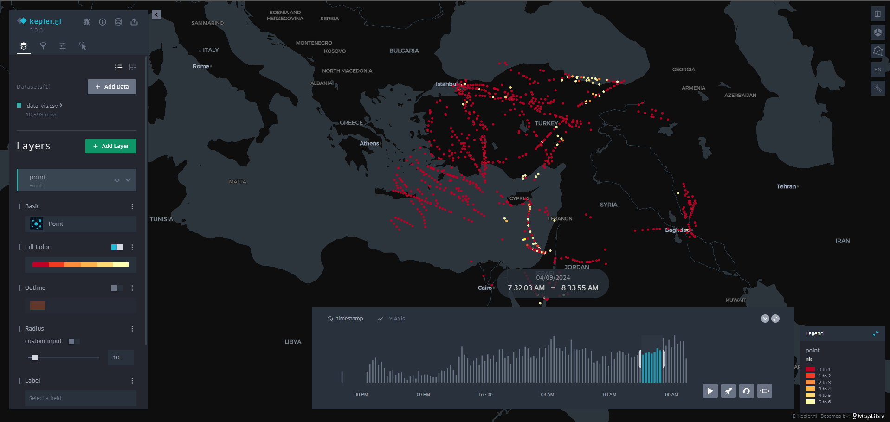
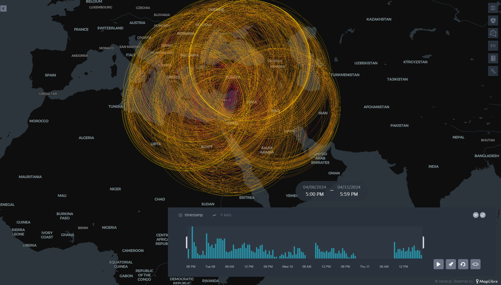

# GPS INTERFERNCE

In this proejct I am using AIRPLANES.LIVE ADS-B REST API to create database from which it is then possible to view airplanes which are experiencing GPS interference & the option to traingualte the locartion of the GPS jammer itself 






# Flight Data Collector

This repository contains a Python application for collecting and storing flight data from an external API. The data is processed and stored in a MySQL database, leveraging SQLAlchemy for ORM (Object Relational Mapping) and Flask for the web framework.

## Table of Contents
- [Features](#features)
- [Setup](#setup)
- [Usage](#usage)
- [Contributing](#contributing)
- [License](#license)

## Features

- **API Integration**: Fetches flight data from the Airplanes Live API.
- **Database Storage**: Uses SQLAlchemy to interact with a MySQL database.
- **Data Processing**: Collects and processes flight data, including geolocation information.
- **Scheduled Data Collection**: Utilizes APScheduler to schedule regular data collection intervals.
- **Web Framework**: Runs a Flask application to manage and schedule data collection.

## Setup

### Prerequisites

- Python 3.8+
- MySQL Database
- Required Python packages (see `requirements.txt`)

### Installation

1. **Clone the repository**:
    ```bash
    git clone https://github.com/yourusername/flight-data-collector.git
    cd flight-data-collector
    ```

2. **Install dependencies**:
    ```bash
    pip install -r requirements.txt
    ```

3. **Run the application**:
    ```bash
    python jammer2.py
    ```

## Usage

### Running the Flask Application

To start the Flask application, ensure you have configured the database connection correctly and then run:
```bash
python jammer2.py
```
The application will start and schedule the data collection job to run every 30 seconds.

### API Call

The `api_call` function fetches flight data for a specified latitude, longitude, and radius:
```python
api_call(lat=59.530270, lon=29.458939, radius=750)
```

### Data Collection

The `collect_data` function collects flight data from the API and processes it to store in the database.

## Contributing

We welcome contributions! Please fork the repository and submit a pull request with your changes. Ensure you follow the coding guidelines and include tests for new features or bug fixes.

## License

This project is licensed under the MIT License - see the [LICENSE](LICENSE) file for details.
